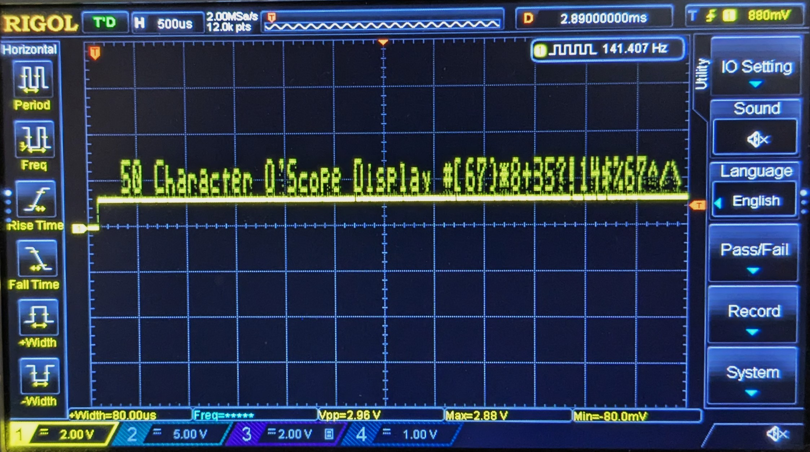

# retro
A 1-bit O'scilloscope text display using a Raspberry Pi Pico Processor.
Only one resistor and capacitor are needed to complete the project. 
Bring your own Pico processor and O'scope.

A hookup diagram is provided in the retro 1-bit display pdf file.

